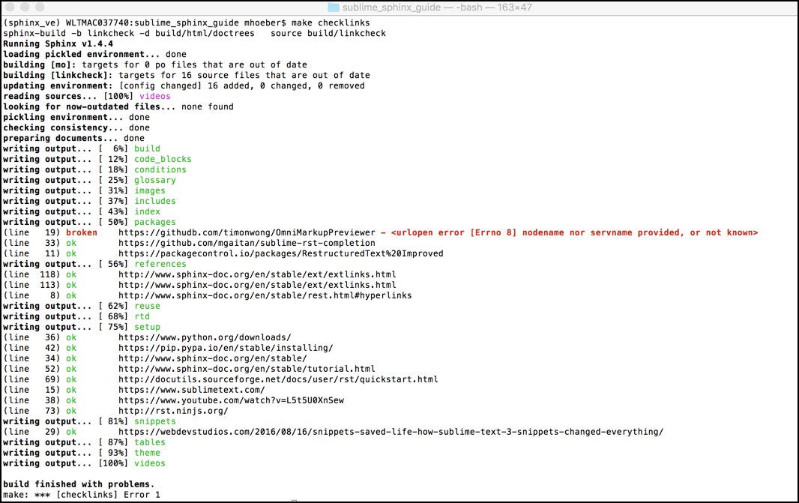

Add Links
##################

You can include links to other locations in the
same document, to locations in other documents and to external
websites.

For more information about creating links using |RST| and Sphinx, see
:xref:`Sphinx Hyperlinks`.

Links to Sections in the Same Document
****************************************************

You can link from text to a heading in any other part of the document by using
the ``:ref:`` command with the heading text as the parameter. For example,
this text in another part of this document would link to this section:

.. code-block:: RST

  :ref:`Cross-References to Locations in the Same Document`

.. note:: Make sure you have ``sphinx.ext.autosectionlabel`` in your extensions in your conf.py file. For example, ``extensions = ['sphinx.ext.autosectionlabel']``

The heading text is printed as the link text.

Use Custom Link Text
=======================

For internal links that use text other than the heading for the
section that you're linking to, use ``:ref:`custom text<Heading Text>```
syntax, as in the following example.

.. code-block:: RST

  Learn how to :ref:`link to a different section<Cross-References to Locations in the Same Document>`.

.. note::
  Do not include a space between the last word of the link text and the opening
  angle bracket for the anchor text.

In this example, **link to a different section** is the link text, and **Cross-
References to Locations in the Same Document** is the heading text.

Use a Custom Anchor 
=========================

When you have two sections with the same title in a project, you will get
build errors when you have a link to either section, because Sphinx does not
know which section to link to. 

In this case, you can create a custom *anchor* directly above the title and
link to it, instead of the title itself. For example, if you have a section
called **Overview** in each part of your document, you should add a more
specific anchor above the section heading.

.. code-block:: RST

  .. _RST Overview:

  Overview
  **********

  RST Overview content


  .. _Sphinx Overview:

  Overview
  *********

  Sphinx Overview content

In a ``:ref:`` command, you then use the anchor text. For example:

.. code-block:: RST

  This is a link to the RST Overview: :ref:`RST Overview`

  This is a link to the Sphinx Overview: :ref:`Sphinx Overview`

In both cases, the link text is the section title, **Overview**, unless you `Use Custom Link Text`_.

Links to External Web Pages
*****************************************

To link to an external web page, use the following syntax:

.. code-block:: RST

  `Link text <link URL>`_

For example:

.. code-block:: RST

  `CNN <http://cnn.com>`_

You can also separate the link and the target definition. For example:

.. code-block:: RST

  Get the latest news at `CNN`_.

  .. _CNN: http://cnn.com/


Use the External Links Extension
*********************************

Managing links in large projects with multiple writers can get complicated.
You want to avoid having multiple definitions for the same link.

For such cases, try using the :xref:`Sphinx External Links`.

With this extension, links to external web pages are stored in a top-level
folder. Each link is stored in its own ``.py`` file.

The following example shows the structure of the link definition in a ``.py``
file (for the :xref:`Sphinx External Links` link):

.. code-block:: python

  import link

  link_name = "Sphinx External Links"
  user_text = "External Links Extension"
  url = "http://www.sphinx-doc.org/en/stable/ext/extlinks.html"

  link.xref_links.update({link_name: (user_text, url)})

You then reference a link within content with the ``:xref`` role and the link
name. For example::

  :xref:`Sphinx External Links`

The user text is displayed and links to the URL.

Before you create a link, check if the link already exists in the project.
Reuse an already-defined link when possible.

Setup External Links
=====================

To set up the external links extension, take the following steps.

(You can also copy the setup of the project for this document on GitHub.)

#. Create a folder in your source folder called ``links``.

#. Add a file called ``__init__.py`` to the ``links`` folder, with the
   following content:

   .. code-block:: python

      from os.path import dirname, basename, isfile

      import glob
      modules = glob.glob(dirname(__file__)+"/*.py")

      __all__ = [ basename(f)[:-3] for f in modules if isfile(f)]

#. Add a file called ``link.py`` to the ``links`` folder, with the following
   content:

   .. code-block:: python

      xref_links = {"key" : ("link text", "URL")}

#. In the project ``conf.py`` file, add the following lines:

   .. code-block:: python

      import sys, os
      sys.path.append('.')
      from links.link import *
      from links import *

Then save any link definition files in the ``links`` folder and reference with
``:xref:`link_name```.

Add Link Make Command
=======================

You can manually create and save new link files.  You could also add a command
to the project make file, to make it fast and easy to add new link
definitions.

For example, the following additions to the ``Makefile`` enable you to create
a link from the command line (without error checking):

.. code-block:: bash
  
  LINKSDIR       = source/links
  .PHONY: link
  link:
    @read -p "Enter a Unique Link Name: " link_name; \
    read -p "Enter the link text the user sees: " link_text; \
    read -p "Enter the URL: " link_url; \
    read -p "Enter the .py file name (use_lower_case_and_underscore of link name): " file_name; \
    echo "The link name is: " $$link_name; \
    echo "The link text is: " $$link_text; \
    echo "The URL is: " $$link_url; \
    echo "Creating the file: " $(LINKSDIR)/$$file_name".py"; \
    echo "Enter the link in content as :xref:\`"$$link_name"\`"; \
    echo "The user will see:" $$link_text; \
    echo "Make sure you build and test the link."; \
    echo "import link\n\nen_us_user_text = \"$$link_text\" \n\n\
  links.xref_links.update({\"$$link_name\": (en_us_user_text, \"$$link_url\")})" \
    > $(LINKSDIR)/$$file_name".py" \

You can then create a link using the ``make link`` command from any project.
You are prompted to enter the:

* Link key
* Link text
* URL
* Python file name

You could also add a Sublime :ref:`snippet<Use Snippets as Shortcuts>` for new links.

Test External Links 
=========================

You can use the built-in Sphinx command, ``checklinks`` to test all external
links in your document. The command checks that a working web page is accessed
at the given URL and reports any errors.

Add the following code to the project ``Makefile``:

.. code-block:: bash
  
  LINKCHECKDIR  = build/linkcheck

  .PHONY: checklinks
    checklinks:
    $(SPHINXBUILD) -b linkcheck $(ALLSPHINXOPTS) $(LINKCHECKDIR)
    @echo
    @echo "Check finished. Report is in $(LINKCHECKDIR)."

Then, from the command window, enter:

.. code-block:: bash
  
  make checklinks

Sphinx compiles the document and tests all links. It shows the results in the
command window, and writes results to the file ``output.txt`` in the build
directory.

For example, the following results show one link error.


